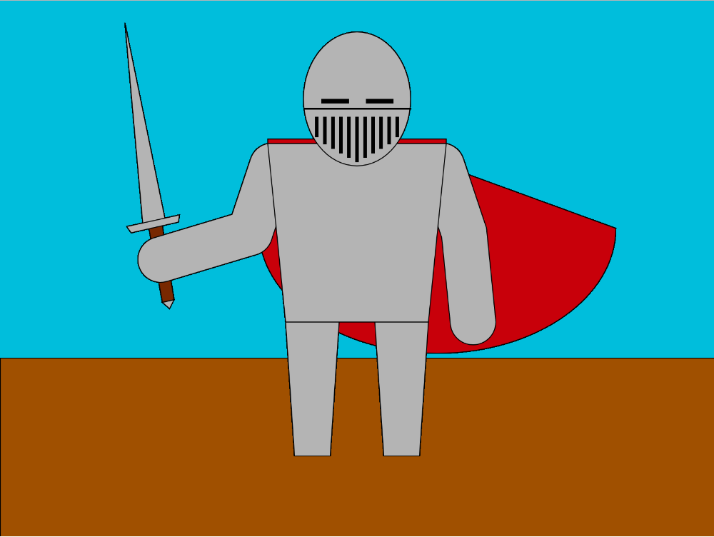
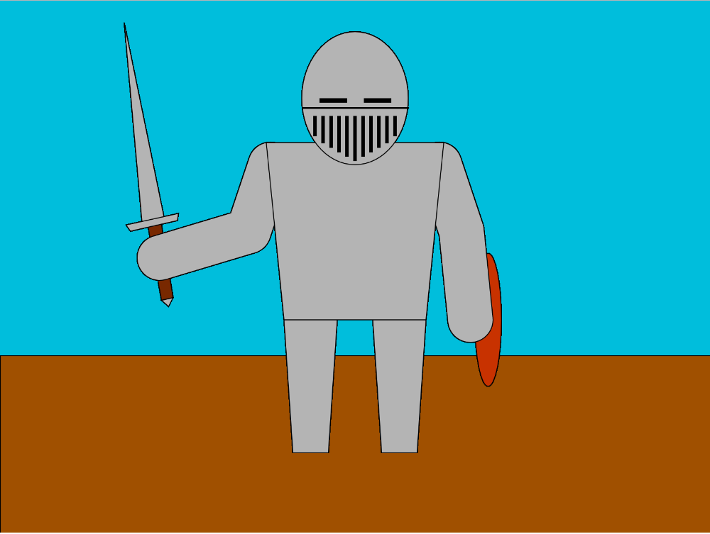
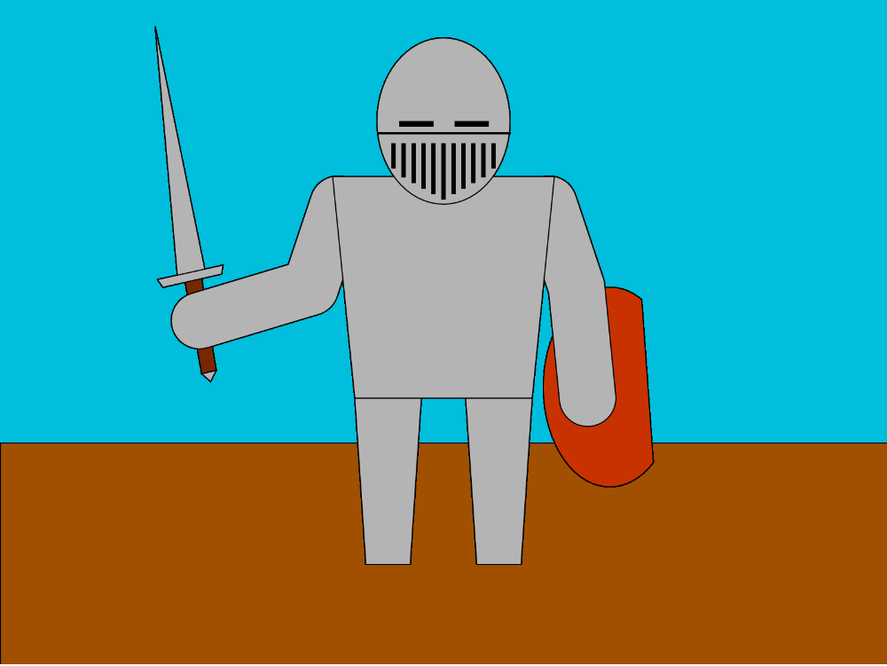
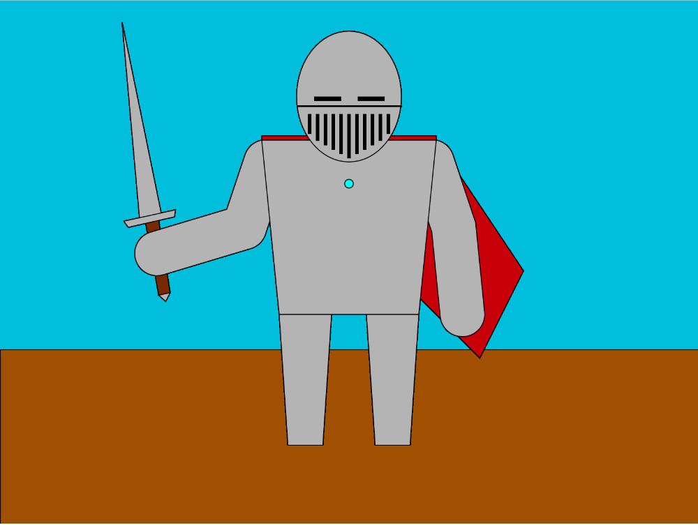

# Ryan's Knight
### Final version

This creative assignment was a lot of fun. Deciding on what to create was difficult, however once settled on the knight, the process became a fun puzzle.

I started simply with a plain background, and awaited to see how it developed. I knew generally how to create my knight, however learning the exact creation was more difficult. As I learned, it became more simplified, and streamlined. The first major challenge was determining which coordinates corresponded to which point in a quadrilateral. Multiple times, I found myself with a twisted, and distorted shape, instead of the four sided geometry I planned. This proved most challenging with the sword hilt. All those points are so close together, it became very difficult to keep track of them, while editing.

The Knight went through many design alterations before being completed. Once the general structure was completed, I attempted to create a shield. This began as a simple ellipse.

However, I was not satisfied with the result, so I attempted a arc (chorded).

This seemed nice, however historically this bothered me. Fully armored knights usually did not used shields. So I decided to scrap the shield entirely. This lead to a rather plain picture, and I needed to add something. I eventually came to the conclusion of a cape. my first attempt did not look all that nice, it was a simple quadrilateral, and didn't look much like fabric.
Pictured here is also a small blue dot I make to help me guide my objects into place.

My final version uses a Arc style cape. This give a much more loose fabric look to the image.

