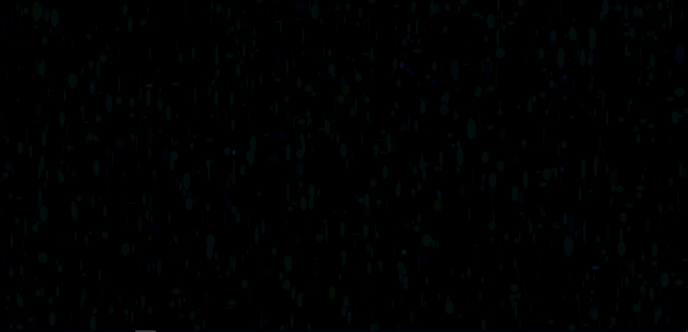

## Generative Art

The fun part of this assignment is seeing the results. You might know what SHOULD happen, but you have no details until you start the program.

I tried a few variations, but I eventually decided on this "rain" type generator.

