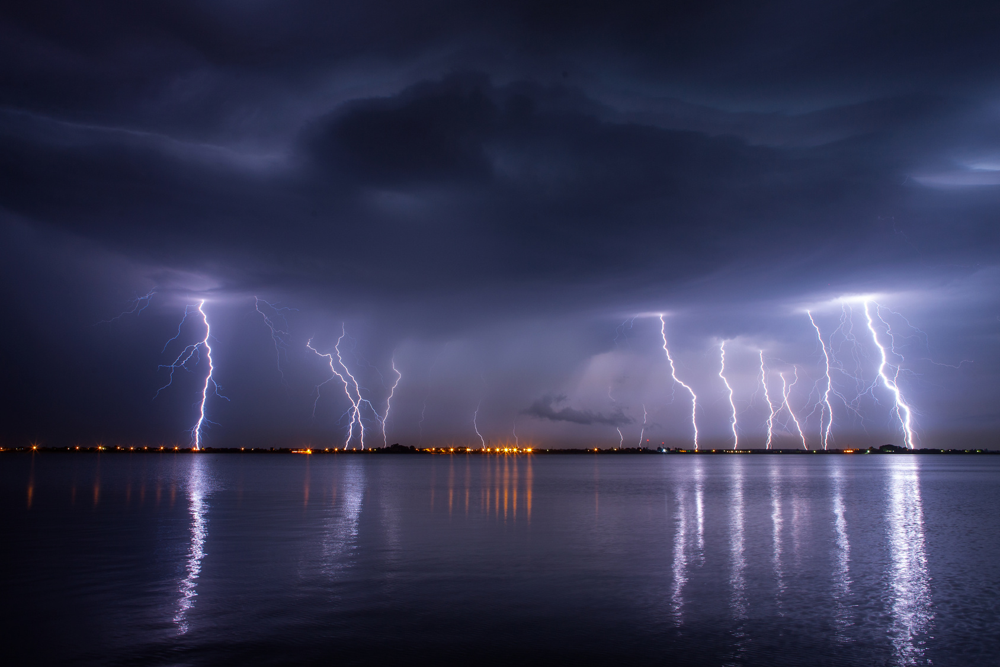

# Using Methods to make easier work.

The original idea was to create a thunderstorm. Getting all the elements aligned was the most difficult aspect to this project.

My plan was to recreate something like this:

With the lightning fading into clouds.
