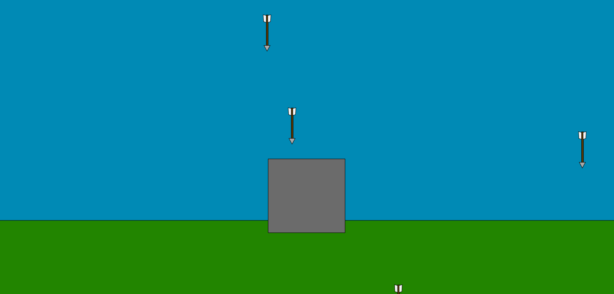
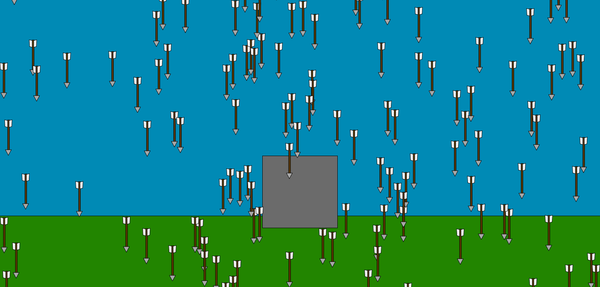

# Arrow Storm V1

this is a continuing project, V2 should be in homework 9. At which point, it should be interactive.

I know the "castle" in the background is uninspiring, but I did enjoy creating it.

I would say this assignment is the most I've struggled with so far. Creating Classes isn't too difficult, however utilizing them proved perplexing for me.

