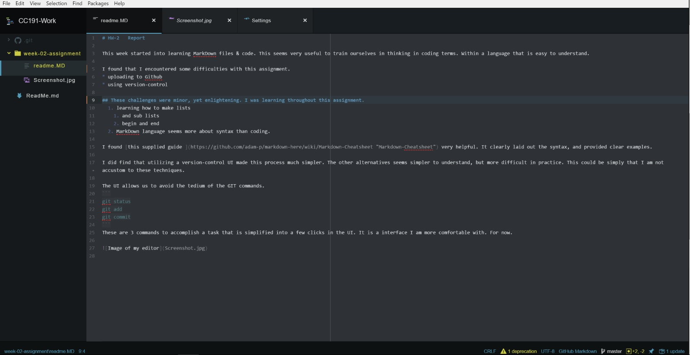

# HW-2   Report

This week started into learning MarkDown files & code. This seems very useful to train ourselves in thinking in coding terms. Within a language that is easy to understand.

## I found that I encountered some difficulties with this assignment.
* uploading to Github
* using version-control  

These challenges were minor, yet enlightening. I was learning throughout this assignment.
  1. learning how to make lists  
    1. and sub lists
    2. begin and end
  2. MarkDown language seems more about syntax than coding.  

I found [this supplied guide ](https://github.com/adam-p/markdown-here/wiki/Markdown-Cheatsheet "Markdown-Cheatsheet") very helpful. It clearly laid out the syntax, and provided clear examples.

I did find that utilizing a version-control UI made this process much simpler. The other alternatives seems simpler to understand, but more difficult in practice. This could be simply that I am not accustom to these techniques.

The UI allows us to avoid the tedium of the GIT commands.
```
git status
git add
git commit
```
These are 3 commands to accomplish a task that is simplified in the UI.


